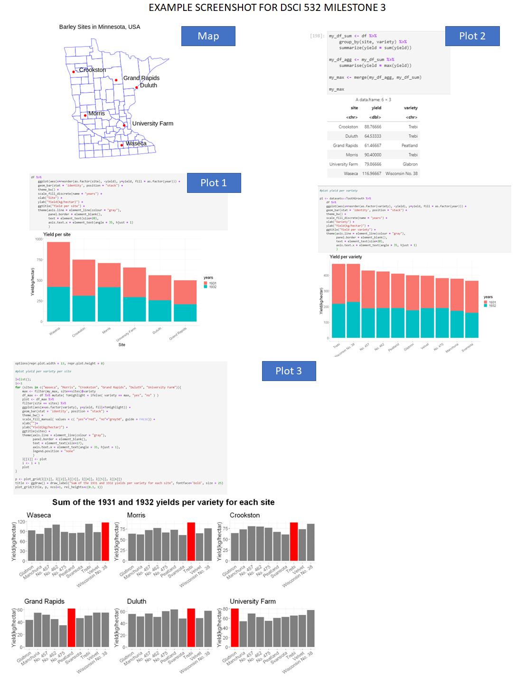
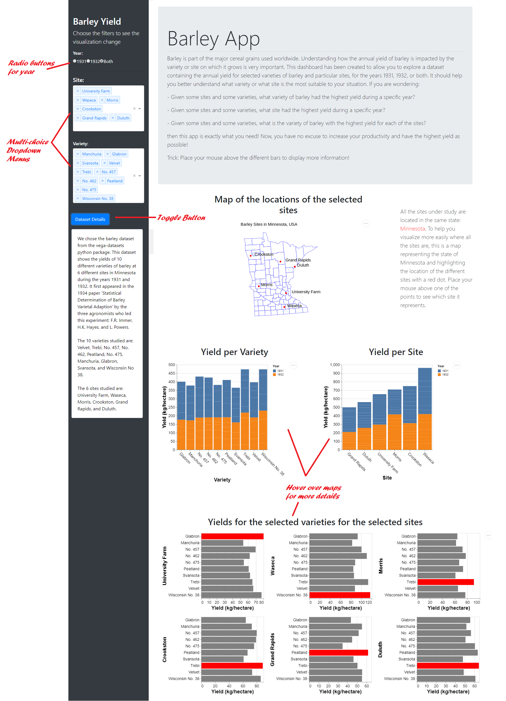

# DSCI_532_L02_group207_dashboards
Public Repository for Group 207

#### App Description 

The app contains a landing page that displays the annual yield of barley for a range of varieties and sites in Minnesota for the years 1931 and 1932.  The user has an option to filter out variables from the annual yield distribution display, by the varieties of barley, by the sites, and finally by the year. There is also a map that will highlight the selected sites in Minnesota for which the yield is displayed. The first two graphs are comparing the yield vs variety and site, respectively. The third graph is a heatmap that makes it easy to see what sites have the highest yield for each variety.  

Users will find the app helpful to compare the yield across multiple sites in Minnesota and to decide which variety has the maximum yield through the app. 
 

 #### App Usage

Select the sites, the varieties and the year(s) on which you want to have some information. The app will automatically update.
The points on the map represent the position of the different sites. If you go down on the page, you'll see the 3 graphs described above. Each graph is interactive: you can zoom out on it to see the values more precisely. If you put your mouse over one bar of a graph, you'll see the site, the variety, the year and the yield corresponding to this bar. For the heat map, the behavior is similar when you mouse over a tile instead of a bar. 

#### App layout  

