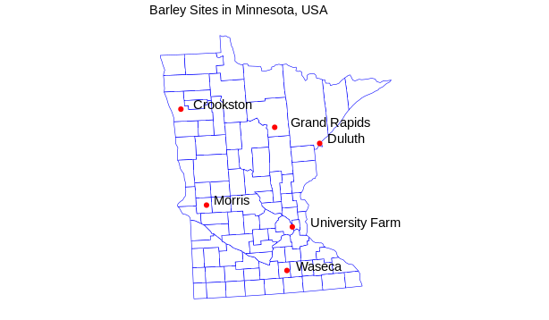

# Reflections: Group 207
### Milestone 4

### Strengths:
- Overall, the app answers the research questions as given in our proposal. It allows any farmer to quickly see what barley varieties and/or what sites in Minnesota give the highest yields.
- With the inclusion of the heat map in place of the faceted bar graph from before, determining where each site is best per each variety is way easier. From the lab feedback session, many users did not understand what the faceted bar graph was even trying to display. The heat map, through its superior use of color, alleviates this issue.
- With the inclusion of the map, the app allows the user to come up with their own inferences as to why certain sites may outperform others (it is likely related to latitude).
- The app, through improved documentation over previous versions, is self-explanatory and explains explicitly how to use the app and the interactivity of the graphs.

### Limitations:

- Please note: we could not deploy our app on Heroku because of our usage of the package usmaps which depends on rgdal. This package [causes a lot of problems with deployment to Heroku and is a known bug in plotly.](https://ubc-mds.slack.com/archives/C24J4AW3Z/p1576255148006900?thread_ts=1576188029.304900&cid=C24J4AW3Z) We cannot install rgdal in Heroku, since rgdal requires an external package "GDAL" which requires terminal access to the server running on Heroku.    
- We really wanted to make the map more interactive. Our goal was to make the map more useful by making it be the “site selector” of the app itself, rather than the dropdown menu. We searched for hours but could not find any solution or example involving this type of functionality in dashR, besides [this.](https://plotly-r.com/linking-views-with-shiny.html#shiny-plotly-inputs) However, the link above really uses shiny as a backend to carry out the functionality rather than dash.
- The layout, due to a lack of bootstrap components, is not as clean as the previous Python app. In particular, there is no toolbar and no mouseover hovers to hide text that clutters the app (such as the description of the dataset.
- ggplotly currently has a bug where it modifies geom_text() objects to not display correctly. Furthermore, it appears to ignore any arguments to geom_text() that tries to move the text. Here is a photo of what the map is supposed to render as, just using ggplot2:

 

### Future Improvements/Additions:

  - As mentioned above, we really could make the map far more interactive by having it act a filter. However, it is clear that dashR makes this kind of functionality hard to pull off without resorting to a completely different framework (shiny).
  - The style and layout of the app could be made to be more visually appealing.
  - Adding a toolbar that is fully collapsable as a menu would functionally make the app easier to use. A problem with the app right now is that the user has to constantly scroll up to the menu to change filter parameters. If we had a floating, collapsable toolbar that followed the user as they scrolled down this would solve this problem.
  - Further exploring the correlation between latitude and yield could produce interesting plots.